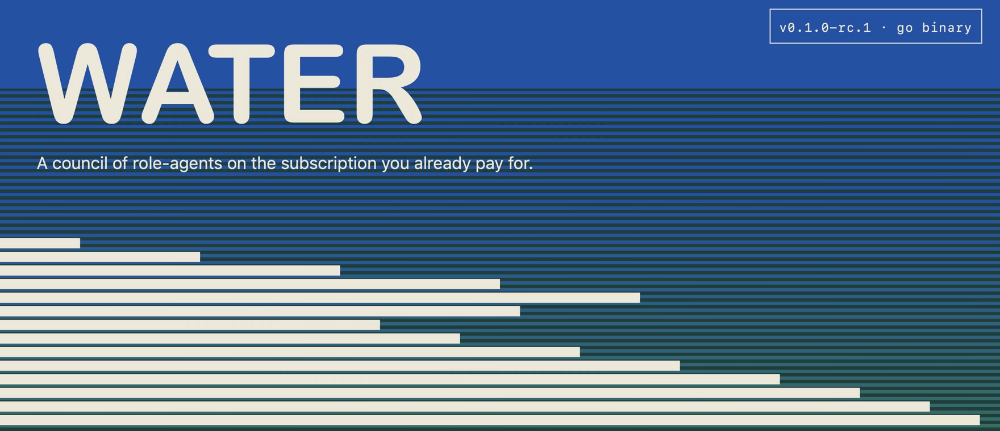
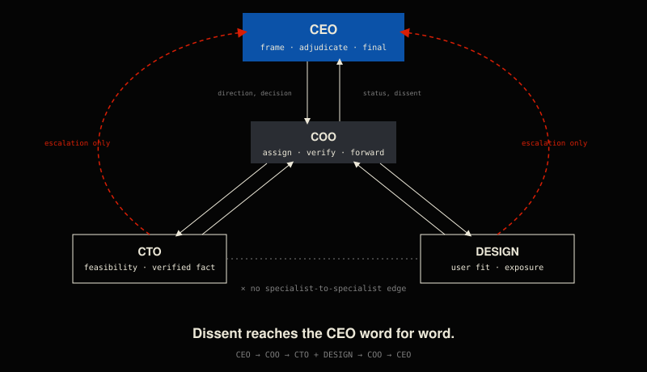
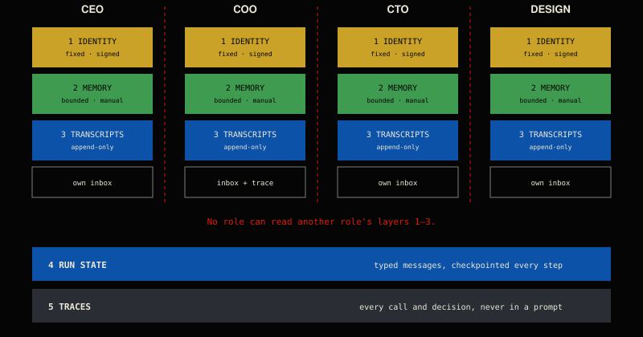

<p align="center">
  
</p>

Water is a single Go binary that hosts four role-agents: **CEO**, **COO**, **CTO** and **Design**.
Each role has its own private persona (identity, distilled experience, reasoning method, skills)
and its own private memory. No role can read another's. You can talk to one role directly, or
hand a brief to the team. In a team run the CEO frames the problem, the COO assigns work to the
CTO and Design, the COO checks what they actually delivered, and the CEO makes the final call.
This all runs through a state graph that checkpoints after every step, so a stopped run can
resume. Every model call goes through the `claude` (Claude Code) or `codex` (OpenAI Codex) CLI
you already have, signed in with your Claude or ChatGPT plan. Water doesn't use a metered API key
and refuses to use one unless you explicitly opt in.

<p align="center">
<code>151 tests &middot; 21 packages &middot; passing</code>&nbsp; &nbsp;<code>0 metered calls</code>&nbsp; &nbsp;<code>v0.1.0-rc.1</code>
</p>

<details>
<summary><strong>How the roles talk</strong> — the permission graph</summary>
<br>

A brief flows **CEO &rarr; COO &rarr; CTO + Design &rarr; COO &rarr; CEO**. Specialists never
message each other directly; escalations and dissent bypass the COO and reach the CEO word for
word.



</details>

<details>
<summary><strong>Five kinds of state</strong> — how memory stays private</summary>
<br>

Each role's identity, memory and transcripts are private to it; no role can read another's. The
only shared channel is the run's own message log, and the only thing every role can see is the
trace.



</details>

---

## Prerequisites (read this first)

**Water can't do anything without one of these two CLIs installed and signed in.** Water doesn't
install them and doesn't bundle a model. If neither is there, every command except `version`
and `doctor` fails.

| You pay for | Install | Sign in | Check |
|---|---|---|---|
| A paid **Claude** plan (Pro or Max) | `curl -fsSL https://claude.ai/install.sh \| bash`<br>or `npm install -g @anthropic-ai/claude-code` | `claude auth login` | `claude auth status` |
| A paid **ChatGPT** plan (Plus, Pro, or a business plan) | `npm install -g @openai/codex` | `codex login` | `codex login status` |

- You need only one. If both are signed in, Water prefers `claude`, and you can pick a different
  backend for each role (see [config](#water-config)).
- The `npm` routes need Node.js.
- **Sign in to Claude yourself before running `water onboard`** (see [First run](#first-run)
  for why).
- Codex caveats in this build: Water's file tools aren't wired for Codex, so roles running on
  Codex have no tools. PDF attachments are refused on Codex (Claude reads them natively).

---

## Install

### macOS and Linux

Release binaries exist for `darwin` and `linux` on `amd64` and `arm64`. The macOS builds have been
installed and run end to end. **The Linux builds are produced by CI but haven't been run on a
real Linux machine yet.**

> **The GitHub repository is currently private.** Until it's public, the anonymous one-liner
> below returns 404. If you have access, export a token first (a personal access token with
> read access to `kranthi7899/water`, or `$(gh auth token)` if you use the GitHub CLI) and the
> installer will use the GitHub API instead:
>
> ```sh
> export GITHUB_TOKEN=ghp_yourtokenhere
> ```

**This is macOS/Linux only — it does not work on native Windows** (see [Windows](#windows) below).

```sh
curl -fsSL https://raw.githubusercontent.com/kranthi7899/water/main/install.sh | bash
```

The installer:

1. Detects your OS and architecture.
2. Downloads the latest release and verifies it against `checksums.txt`.
3. Installs `water` to `~/.local/bin` (or `$XDG_BIN_HOME` if set).

To install to `/usr/local/bin` instead (uses `sudo` if needed):

```sh
curl -fsSL https://raw.githubusercontent.com/kranthi7899/water/main/install.sh | bash -s -- -g
```

To pin a specific version instead of the latest release:

```sh
curl -fsSL https://raw.githubusercontent.com/kranthi7899/water/main/install.sh | WATER_VERSION=v0.1.0-rc.1 bash
```

Success looks like:

```
water: downloading water_0.1.0-rc.1_darwin_arm64.tar.gz from kranthi7899/water v0.1.0-rc.1
water: installed water 0.1.0-rc.1 (…) to /Users/you/.local/bin/water

next:  water onboard
```

**Manual download (if you'd rather not pipe to bash):**

1. From the [Releases page](https://github.com/kranthi7899/water/releases), download
   `water_<version>_<os>_<arch>.tar.gz` for your platform, plus `checksums.txt`.
   - `<os>` is `darwin` or `linux`.
   - `<arch>` is `arm64` (Apple Silicon, ARM Linux) or `amd64` (Intel/AMD).
   - With the GitHub CLI: `gh release download --repo kranthi7899/water --pattern '*darwin_arm64*' --pattern checksums.txt`
2. Verify, extract, and install (macOS example; substitute your `<os>_<arch>` and, on Linux, use
   `sha256sum -c -` in place of `shasum -a 256 -c -`):

   ```sh
   grep darwin_arm64 checksums.txt | shasum -a 256 -c -
   tar -xzf water_*_darwin_arm64.tar.gz
   mkdir -p ~/.local/bin && install -m 0755 water ~/.local/bin/water
   ```

The macOS binary isn't code-signed. If you downloaded the tarball with a browser and macOS blocks
it, run `xattr -d com.apple.quarantine ~/.local/bin/water`.

**Make sure `~/.local/bin` is on your PATH.** The installer prints a warning if it isn't. To check:

```sh
case ":$PATH:" in *":$HOME/.local/bin:"*) echo "on PATH" ;; *) echo "NOT on PATH" ;; esac
```

If it isn't, add it for your shell and open a new terminal.

zsh (the macOS default):

```sh
echo 'export PATH="$HOME/.local/bin:$PATH"' >> ~/.zshrc && source ~/.zshrc
```

bash on Linux:

```sh
echo 'export PATH="$HOME/.local/bin:$PATH"' >> ~/.bashrc && source ~/.bashrc
```

bash on macOS (login shells read `~/.bash_profile`, not `~/.bashrc`):

```sh
echo 'export PATH="$HOME/.local/bin:$PATH"' >> ~/.bash_profile && source ~/.bash_profile
```

Then run `water version`.

### Windows

**Native Windows isn't supported.** Water ships no Windows binary, and the installer is a bash
script that exits on anything other than macOS or Linux. The supported route is **WSL2**:

1. Install WSL2 with its default Ubuntu distribution. Follow Microsoft's guide:
   <https://learn.microsoft.com/windows/wsl/install>. Restart when it asks.
2. Open the Ubuntu terminal. Do **everything** from here on inside WSL:
   - install and sign in to `claude` or `codex` inside WSL (a Windows-side install won't be seen),
   - then follow the [macOS and Linux](#macos-and-linux) steps above (bash `PATH` fix).

Two caveats:

- WSL is Linux, so the note above applies: the Linux binaries haven't been run on real hardware yet.
- If the sign-in browser doesn't open from WSL, use `water onboard --headless`, which switches to
  the device-code or token flow. Water hasn't been tested under WSL.

### Build from source

You need Go **1.27.1 or newer**. The module path is `water`, not
`github.com/kranthi7899/water`, so `go install github.com/kranthi7899/water/cmd/water@latest`
**won't work**. Clone the repo and install from the checkout instead:

```sh
git clone https://github.com/kranthi7899/water.git
cd water
go install ./cmd/water            # installs to $(go env GOPATH)/bin — make sure that is on PATH
# or: go build -o ~/.local/bin/water ./cmd/water
water version
```

Personas are embedded at build time. If you edit anything under `agents/`, re-stamp and then
rebuild. A binary built before stamping fails to load roles with a `content_hash` mismatch:

```sh
go run ./cmd/water persona sign --no-signature && go build -o ~/.local/bin/water ./cmd/water
```

---

## First run

```sh
water onboard
```

`water onboard` does four things, in order:

1. **Detect.** It checks whether `claude` and `codex` are installed and signed in, and whether a
   metered API key is set. It shows all three backends: `●` means a usable subscription, `$`
   means usable but metered, `○` means not usable.
2. **Sign in** (only for an installed but signed-out CLI). It asks, then runs that CLI's own login
   command. On Codex that's `codex login`, which opens ChatGPT's sign-in page in your browser. On
   an SSH session, in CI, or on Linux with no display, it uses `codex login --device-auth` instead.
   - **Claude: sign in yourself first** (`claude auth login`). Water launches `claude login`
     here, but the current Claude Code CLI (2.1.273) has no `login` subcommand; the real command
     is `claude auth login`. The already-signed-in path is verified; this launch path isn't.
3. **Verify.** It sends one real, minimal message through the chosen backend and requires a
   non-empty reply that wasn't metered. **Onboard doesn't report success without that round
   trip.** If it fails, it exits non-zero with `setup is NOT complete`.
4. **Save.** It writes `~/.water/config.yaml` (set `WATER_HOME` to use another directory), then
   opens the agent picker. Add `--no-picker` to skip the picker.

A successful onboard (captured from a real run, colours off):

```
  ○ api                  metered; no API key configured (api.key or ANTHROPIC_API_KEY)
  ● claude-subscription  subscription login (max, you@example.com)
  ● codex-subscription   subscription login (ChatGPT)

  check verifying claude-subscription with a real round trip… ok (1.777s, 0 metered)

  selected claude-subscription
  config   /Users/you/.water/config.yaml

  next: water chat · water orchestrate "<brief>" · water status
```

If neither CLI is installed and signed in, onboard stops and tells you how to install one.

Flags:

| Flag | Effect |
|---|---|
| `--no-login` | Only detect; never launch a login flow |
| `--headless` | Force the no-browser login path |
| `--no-picker` | Don't open the agent picker afterwards |
| `--yes` | Don't prompt; useful for scripts |

---

## Usage

Typing `water` with no arguments works like typing `claude`. It opens the agent picker, then a
chat with the role you pick. If Water isn't configured yet, it runs `onboard` first.

Global flags that work on every command:

| Flag | Effect |
|---|---|
| `--backend claude-subscription\|codex-subscription\|auto` | Choose the backend for this call |
| `--json` / `-o json` | Machine-readable output |
| `-v` | Show each role's reply as it arrives |
| `-q` | Hide progress output |
| `--debug` | Log each model subprocess: flags, pid, duration, exit |
| `--voice` | Speak replies aloud |

### `water chat`

An interactive terminal session with one role. It has a per-role theme, slash commands, and
transcripts you can resume.

```sh
water chat cto
water chat cto --resume <slug>     # continue a saved session
water chat --picker                # start at the agent picker
```

The screen has a header (role, backend), the conversation, and a composer at the bottom. On exit,
Water prints the resume command, the session slug, the turn count and the duration.

Keys:

| Key | Action |
|---|---|
| Enter | Send |
| Ctrl+J | New line (Shift+Enter also works if your terminal supports the Kitty keyboard protocol) |
| Ctrl+X | Compose in `$EDITOR` |
| Ctrl+Y | Copy the last reply |
| Ctrl+B | Turn voice on or off |

Attach a file for one turn with `@path`, or by dropping a quoted file path at the start of your
message. Supported files:

- Text and source files
- PDFs and images, read natively on Claude
- On macOS: `.doc`, `.docx`, `.rtf` and `.odt`

Anything else (spreadsheets, slide decks, archives) is refused rather than silently dropped.

**Workspace actions in chat.** The directory where you launched `water` is the only place a role
can read or list files.

- Writes and commands are proposed as one plan of up to six actions.
- Water shows the plan as a single approval card: `y` runs exactly that plan once, `n` runs none
  of it, and `d` shows the exact commands.
- Shell commands run only on macOS, inside a `sandbox-exec` profile with no network access.
- On Linux (and so WSL), shell actions are refused because this build has no kernel sandbox.

### In-session slash commands

Typing `/` opens an autocomplete list; Tab completes the top match.

| Command | What it does |
|---|---|
| `/help` | List commands |
| `/clear` | Reset the active context (the transcript file is kept) |
| `/compact [focus]` | Append a summary checkpoint for the active context |
| `/resume [slug]` | List sessions, or continue one by slug |
| `/delete [slug]` | Delete a session (asks for confirmation) |
| `/name <slug>` | Name this session (named sessions are exempt from pruning) |
| `/title <name>` | Alias of `/name` |
| `/model [name]` | Show or set this role's model for this session |
| `/backend [name]` | Show or set this role's backend for this session |
| `/status` | Role, backend and why, session, attachments, workspace root, budget |
| `/usage` | Subscription windows (5-hour and 7-day usage), context used on the last turn, session size |
| `/consult <role> <question>` | Ask another role; its answer arrives as a message, never by reading its memory |
| `/switch <role>` | Talk to a different role (its own inbox, memory and theme) |
| `/agents` | Open the agent picker |
| `/remember [note]` | Save a note, or the last reply, to this role's memory. Refuses to save an unmarked reply that read an attachment or tool output |
| `/why` | Show what shaped the last reply: experience entries, skills, inbox |
| `/skills` | Show which skills loaded on the last turn, and why |
| `/flag [reason]` | Mark the last reply as bad (logged; nothing acts on flags yet) |
| `/attach <path>` · `/attach list` · `/attach clear` | Attach a file for the rest of the session |
| `/editor` | Compose the next message in `$EDITOR` |
| `/copy [N]` | Copy the last reply (or the Nth from last) to the clipboard |
| `/undo` | Drop the last exchange from the active context (the transcript is kept) |
| `/retry` | Send the last message again |
| `/save [file]` | Export the active context as Markdown |
| `/voice [on\|off\|status]` | Speak replies aloud |
| `/quit` | Leave the session |

### `water run`

One turn with one role. It skips the graph and doesn't save a session, so it works in scripts
and pipes.

```sh
water run cto "In two sentences: is SQLite a reasonable choice for a single-user desktop app's local store?"
echo "Review this plan: …" | water run design
water run cto "What does this deck claim?" --attach deck.pdf   # --attach is repeatable
```

Output (real run). Progress goes to stderr and the reply to stdout:

```
────────────────────────────────────────────────────────────
run 20260915-221335-d55d6a
brief In two sentences: is SQLite a reasonable choice for a single-user desktop app's local store?
────────────────────────────────────────────────────────────
  ◦ cto
  • cto claude-subscription 5.024s
────────────────────────────────────────────────────────────
Yes. SQLite is a strong default for a single-user desktop app's local store: it's embedded, needs
no server, keeps everything in one file, … I haven't seen your workload, so check it against those
three before you commit.
────────────────────────────────────────────────────────────
summary  backend claude-subscription  calls 1  metered 0  wall 5.03s
         cto        1 call(s)  5.024s
trace /Users/you/.water/traces/20260915-221335-d55d6a.jsonl
```

In this mode, roles have no file access unless you enable it; see
[`water config`](#water-config).

### `water orchestrate`

A full team run. The flow is:

1. The CEO frames the brief.
2. The COO assigns work to the CTO and Design.
3. The CTO and Design work in parallel.
4. The COO checks what they delivered and reports to the CEO.
5. The CEO decides.

```sh
water orchestrate "Should we rebuild checkout as a native app this quarter?"
water orchestrate --list              # checkpointed runs: resumable or complete
water orchestrate --resume <run-id>   # continue an interrupted run from its last checkpoint
water orchestrate --solo "<brief>"    # the CEO answers alone (for comparison)
```

**The CEO decides whether to delegate.** A single-domain judgment call usually gets one call and
no team. Real output:

```
    → user › ceo [brief]
  ◦ ceo
  • ceo claude-subscription 10.619s
────────────────────────────────────────────────────────────
summary  backend claude-subscription  calls 1  metered 0  wall 10.625s
```

```
This is a judgment call, so I'm answering it myself. No specialist work is needed to reach it.

**No. Don't rebuild checkout as a native app this quarter.**
…
**Tradeoff:** we lose any benefit of an app presence, such as saved payment details and push reminders, for now.
**What would reverse this:** evidence that most payments come from repeat users on phones, and that they're asking for an app.
```

When the brief needs specialists, the progress shows the messages moving between roles. This one
is from a recorded run on Codex; timings are omitted:

```
    → user › ceo [brief]
  • ceo
    → ceo › coo [direction]
    → coo › cto [assignment]
    → coo › design [assignment]
    → cto › coo [dissent]
    → cto › coo [deliverable]
    → design › coo [deliverable]
    → coo › ceo [dissent]
    → coo › ceo [status]
  • ceo
```

That run made 6 calls in about 90 seconds; full-graph runs usually take 1–5 minutes.

- **Dissent is forwarded verbatim.** Water copies it to the CEO itself; the COO can't soften it.
- **Every item in the COO's status is marked** VERIFIED (backed by a tool call recorded in this
  run's trace), FAILED VERIFICATION, or UNCONFIRMED.
- **Interruptions don't lose work.** If a run is stopped, or your subscription's rate-limit window
  runs out, Water saves a checkpoint and prints the `--resume` command. A rate-limit stop exits
  with code 5.

From Water's own measurements (`docs/decisions.md`): the team earns its extra calls when there's
something to gather, such as an attachment or files under a declared tool root. On a paragraph of
assertions alone, it reached the same decision as `--solo` at 8–11× the calls.

### `water memory`

Manage a role's private memory. It's bounded (200 entries or 32 KB by default) and holds only
what you or `/remember` put there.

```sh
water memory cto add "Our API p99 target is 250ms" --tag perf     # prints the new entry id
water memory cto list
water memory cto remove m_9f8dcd4c
water memory cto prune                                            # trims the role's memory back to its bound
```

```
$ water memory cto list
m_9f8dcd4c 2026-09-15T22:13:22Z #perf
  Our API p99 target is 250ms
```

### `water status`

Shows the discovered roles, which backend each one will use and why, memory sizes, and your
subscription budget. Add `--no-probe` to skip checking the backends.

```
roles    from embedded
  ceo      CEO      5 skill(s) · memory 0/0 B orchestrator singleton
           backend claude-subscription explicit preference via config backend.preferred
  coo      COO      6 skill(s) · memory 0/0 B · tools trace:current-run
           backend claude-subscription explicit preference via config backend.preferred
  cto      CTO      6 skill(s) · memory 0/0 B
           backend claude-subscription explicit preference via config backend.preferred
  design   Design   5 skill(s) · memory 0/0 B
           backend claude-subscription explicit preference via config backend.preferred
backend  claude-subscription explicit preference via config backend.preferred
router   hierarchy · checkpointer file · rounds 2 · steps 24
budget   claude-subscription: 5h window 26% used (resets 12:00) · 7d window 56% used · observed 5h59m0s ago
config   /Users/you/.water/config.yaml
```

The `budget` line comes from the rate-limit data `claude` reports on each call. Codex doesn't
report this data.

### `water doctor`

A full checkup: backends and sign-in, which backend is selected, any metered keys in your
environment, roles, memory, directories, tools, themes, sessions, voice, and whether onboard's
round trip passed. Start here when something's wrong.

```
  ✓ config                   /Users/you/.water/config.yaml
  ! backend api              metered; no API key configured (api.key or ANTHROPIC_API_KEY)
  ✓ backend claude-subscription subscription login (max, you@example.com)
  ✓ backend codex-subscription subscription login (ChatGPT)
  ✓ selection                claude-subscription (explicit preference via config backend.preferred)
  ✓ credential leak          no metered API keys exported in this environment
  ✓ roles                    4 discovered from embedded; orchestrator ceo; 0 persona(s) unwritten
  ✓ memory ceo               0 entries / 0 bytes (max 200 / 32768)
  …
  ✓ tools                    disabled (tools.enabled=false); every role invokes nothing
  ✓ voice                    os (speak only; listen is a documented no-op) · ceo=Daniel, coo=Samantha, cto=Rishi, design=Moira
  ✓ onboard                  verified round trip at 2026-09-15T22:06:36Z
```

### `water config`

With no arguments, prints every setting, its value, and where the value came from (`file` or
`default`). The file is `~/.water/config.yaml`.

```sh
water config
water config get backend.preferred
water config set backend.preferred codex-subscription
```

```
file /Users/you/.water/config.yaml
  backend.allow_metered        false                  file
  backend.preferred            claude-subscription    file
  memory.max_entries           200                    default
  orchestration.call_timeout   4m                     default
  orchestration.max_rounds     2                      default
  orchestration.timeout        20m                    default
  sessions.keep                30                     default
  tools.enabled                false                  default
  tools.roots                                         default
  voice.provider               os                     default
  …
```

Settings you're most likely to change:

- **`backend.preferred`**: `claude-subscription`, `codex-subscription` or `auto`. You can also set
  one role to a different backend with `backend:` in its `role.yaml`. Precedence is:
  `--backend` flag → `role.yaml` → config → auto.
- **`tools.enabled` and `tools.roots`**: file access for `run` and `orchestrate`. It's off by
  default. When enabled, the CTO and Design can read (never write) the folders you list. The CEO
  and COO never get file access. See `docs/tools.md`.

  ```sh
  water config set tools.enabled true
  water config set tools.roots "~/work/specs"
  ```

- **`orchestration.max_rounds`**, **`orchestration.timeout`** and
  **`orchestration.call_timeout`**: limits on how long a team run goes.

### Other commands

| Command | What it does |
|---|---|
| `water diagnose <run-id>` | Checks a finished run's trace: did dissent survive, did every message follow an allowed path, was "done" work actually verified, did specialists influence the outcome, was there a rate-limit interruption |
| `water replay <run-id> [seq\|role] [--print\|--edit]` | Re-sends one recorded model call on its own. `--print` shows exactly what the model saw; `--edit` lets you change it first |
| `water debug dump <run-id>` | Writes the live state of a running orchestration (active nodes, subprocesses, goroutines) without stopping it. `orchestrate` prints this command when it starts |
| `water dashboard [--addr 127.0.0.1:0] [--no-open]` | Read-only local web page of roles, runs, diagnostics and tool calls. Listens on loopback only |
| `water skills` | Which skills each role has actually loaded across your recorded runs, and which never have. Read-only |
| `water voice [--role cto] "text"` | Test speech output in a role's voice (each role has its own voice and pace): `say` on macOS (verified), `spd-say` or `espeak` on Linux (not verified). There's no speech-to-text |
| `water version` | Print version, commit and build date |
| `water persona show\|edit\|sign\|verify` | Inspect and re-stamp persona files. **Works only from a source checkout**; release binaries keep personas embedded and hidden |
| `water experience <role> grow\|candidates` | Offline tools for growing persona experience. Developer-only |

Exit codes:

| Code | Meaning |
|---|---|
| 0 | OK |
| 1 | Error |
| 2 | Bad usage or a missing prerequisite |
| 3 | No usable backend, or a metered backend was refused |
| 4 | Not configured (run `water onboard`) |
| 5 | Subscription rate limit reached (resume later) |
